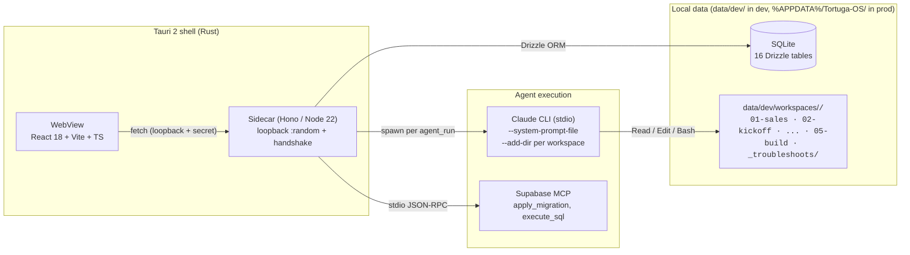

# 🐢 Tortuga OS

> **Desktop agentic ERP** for solo consultants and small teams. Turn a client conversation into a quote, kick off a project, and let AI agents run the build → QA → handoff loop while you supervise. Tauri 2 + React + Hono + SQLite + MCP. Local-first.

<p align="center">
  <a href="#"></a>
  <a href="LICENSE"></a>
  <a href=".github/workflows/ci.yml"></a>
  <a href="https://tauri.app"></a>
  <a href="https://hono.dev"></a>
  <a href="https://nodejs.org"></a>
</p>

Source-available product for orchestrating a team of AI agents on consultancy projects. Code standards live in [`docs/STANDARDS.md`](docs/STANDARDS.md) and contribution rules in [`CONTRIBUTING.md`](CONTRIBUTING.md) — both are binding.

---

## What this is

Tortuga OS is a desktop app where you run **end-to-end consultancy projects** from a single workspace. The flow it orchestrates is the canonical consulting one:

```
discovery → quote → kickoff → architecture → build → QA → handoff
```

For each story in a project, a specialized AI agent runs the work as a task. You supervise from a wizard; the agent reads the workspace, writes code, runs gates, and tells you when human input is needed. When you observe a runtime error while validating, a **troubleshooter** agent diagnoses the cause and proposes a fix end-to-end (code edits, SQL migrations via Supabase MCP, and a Dart integration test that proves the fix).

The whole thing lives **on your machine**: SQLite DB, project workspaces under `data/dev/workspaces/<CODE>/`, agent transcripts on disk. The Tauri shell exposes a Hono sidecar on a random loopback port with a handshake token — no external service required.

## Status

- ✅ **F1–F2** Sales & kickoff: discovery chat, parametric quoting with modules + milestones, phase scaffolding.
- ✅ **F3** Build: per-stack dev agents (Flutter, Next.js, Vite-React, Node), gate matrix (G1 analyze · G3 build · G4 boot · G5 fidelity · G6 real-work · G7 a11y), in-app emulator preview via scrcpy.
- ✅ **F4** Troubleshooter: paste a runtime error → structured diagnosis → apply code + SQL (via Supabase MCP) → run integration test → retry up to 3 times → escalate.
- 🚧 **F5+** Handoff, multi-workspace billing, marketplace of agents.

See [`docs/PHASES-WORKFLOW.md`](docs/PHASES-WORKFLOW.md) for the binding phase contract.

## Roadmap (next 3-6 months)

The four bets that drive priority right now. Each one closes a real gap in the product, not a "nice to have". Tracked with milestones on GitHub; details may shift but the categories are stable.

### 1. Close the consulting loop end-to-end

Today the system runs `discovery → quote → kickoff → build → QA`. What's missing is the **handoff**: deploy artifacts, client documentation, walkthrough. Plus completing the troubleshooter evidence (`_troubleshoots/<id>/report.md`, `timeline.jsonl`, before/after screenshots) so every fix leaves a permanent audit trail. Without this, the agentic ERP cannot deliver a project front-to-back.

### 2. Operational scale (multi-workspace + metrics)

Today Tortuga is single-workspace. To grow from one consulting project to five in parallel we need workspace isolation + a metrics layer: real margin per project (LLM cost + human time vs. billed), productivity per agent, time-to-acceptance per task type. Without this, you can't run Tortuga as a real business — only as a personal assistant.

### 3. Viable monetization (BYOK + LLM cost control)

The BUSL-1.1 license implies a commercial offering. The core mechanic is **BYOK (bring-your-own-key)**: the operator plugs their Anthropic / OpenAI / etc. keys, sees consumption in real time, and pays Tortuga a workspace subscription on top. For operators who prefer managed, Tortuga can resell tokens with a markup. Either way, cost transparency is a day-one feature, not an afterthought.

### 4. Marketplace and templates (community-built)

Two adjacent marketplaces:

- **Agent packs** — community-built prompt sets (`.md` files) for specialized roles (e.g. "Salesforce admin agent", "Stripe integration QA"). Versionable, forkable, attributable.
- **Project scaffolds** — full kits for common consulting verticals ("Flutter + Supabase SaaS", "Next.js + Stripe checkout", "RAG over docs"). Accelerates the kickoff → architecture phase.

This is where third parties get to extend Tortuga without forking it.

> Roadmap is intentionally short. Anything not in this list is "later" or "considering". The progress on each line lands in monthly GitHub Releases.

## Pricing & business model

Tortuga OS is **source-available** under BUSL-1.1 (see [License](#license)) and **commercially viable** by design. The model is:

- **Individual / self-hosted** — free. Clone the repo, run `pnpm tauri dev`, plug your own LLM keys. The full agentic ERP runs on your machine, no account required.
- **Workspace subscription** — flat monthly fee per active workspace for operators who want managed updates, cloud sync (when shipped), priority troubleshooter routing, and the marketplace.
- **Managed LLM tokens (optional)** — for operators who don't want to manage keys. Tortuga resells LLM capacity with a transparent markup; consumption is shown in real time. BYOK remains available always.

The BUSL-1.1 license keeps the source open and forkable while preventing third parties from offering Tortuga itself as a competing hosted service. On `2030-05-28` the license converts to Apache 2.0 — Tortuga becomes fully open at that point regardless of business outcomes.

Specific pricing tiers will be published once the commercial offering opens. The principle: **operators always see the true cost of running their consulting agents**, regardless of which tier they're on.

## Quick start

```bash
# Prereqs
node --version       # >= 22
pnpm --version       # 10.x
rustup install stable

# Clone + install
git clone https://github.com/harrinson-gutierrez/tortuga-os.git
cd tortuga-os
pnpm install

# Launch the desktop app (Tauri spawns the sidecar + vite dev server)
pnpm tauri dev
```

The sidecar boots, runs Drizzle migrations against `data/dev/tortuga.db`, and opens a loopback HTTP server on a random port. The shell discovers it via Tauri IPC.

> First-run note: `pnpm tauri dev` compiles the Rust shell which takes ~30s on a cold machine. Subsequent runs are instant.

### Production build

```bash
pnpm tauri build
# → bundle under apps/desktop/src-tauri/target/release/bundle/
```

## Architecture



### Repo layout

```
tortuga-os/
├── apps/
│   ├── desktop/     Tauri 2 shell (Rust) — production bundle entry
│   ├── web/         React + Vite app the WebView loads
│   └── sidecar/     Embedded Hono backend, bundled as a single .cjs
└── packages/
    ├── domain/        Single source of truth for enums (TaskType, AgentKind, GateType, ...)
    ├── contracts/     Zod schemas + DTOs shared between sidecar and web
    ├── core/          Pure use-cases programmed against the Storage port
    ├── storage-sqlite/ Drizzle implementation of the Storage port (16 tables)
    ├── agent-runner/  Claude CLI adapter — spawns, streams, parses tools
    ├── api-server/    Hono router built from core use-cases
    ├── mcp-server/    MCP stdio server exposing Tortuga state as MCP tools
    ├── api-client/    Typed HTTP client the WebView uses
    ├── ui/            Design-system primitives (Card, Button, Badge, ...)
    ├── ui-flows/      Feature panels (ProjectDetail, TaskDetail, TroubleshootShell, ...)
    └── fs-workspace/  Filesystem helpers for project workspaces
```

Cross-package dependencies are enforced by [dependency-cruiser](https://github.com/sverweij/dependency-cruiser) (`pnpm boundaries`).

## Agent roles

Today the system instantiates these agents from `packages/agent-runner/src/prompts.ts`. Each one has its own system prompt scoped to its mission.

| Agent kind | Mission | Model default |
|---|---|---|
| `arch` | Designs the architecture, scaffolds the project, writes `ARCHITECTURE.md`. | Opus 4.7 |
| `tech_lead` | Reviews architecture proposals and writes the build plan. | Opus 4.7 |
| `dev` / `dev-flutter` / `dev-nextjs` / `dev-vite-react` / `dev-node` | Implements features on the chosen stack, reading `ARCHITECTURE.md` first. | Opus 4.7 |
| `designer` | Produces UI specs under `03-design/`. Never touches code. | Opus 4.7 |
| `qa` | Read-only auditor of a freshly-implemented task; emits a verdict JSON. | Sonnet 4.6 |
| `troubleshooter` | Diagnoses runtime errors observed in the running app and emits a structured fix (files + SQL + integration test). | Opus 4.7 |
| `sales` | Turns discovery conversation into a versioned quote draft. | Sonnet 4.6 |
| `pm` | Schedules the work and writes the F7 handoff. Never touches code. | Sonnet 4.6 |

The mapping is in [`apps/sidecar/src/modules/agent-runs/worker.ts`](apps/sidecar/src/modules/agent-runs/worker.ts) (`ROLE_MODEL_OVERRIDES`).

## Gate matrix

Tasks are validated by a gate matrix (per task type). Gates are executable: `scripts/verify-task.ts` runs `flutter analyze`, `flutter build`, boot check, etc., and writes the verdict into `evidence/gates.json` — the only source of truth.

| Gate | Meaning |
|---|---|
| `G1_ANALYZE` | `flutter analyze` / `tsc --noEmit` clean |
| `G2_ARCH` | ARCHITECTURE.md compliance |
| `G3_BUILD` | `flutter build` / `pnpm build` succeeds |
| `G4_BOOT` | App boots cleanly |
| `G5_FIDELITY` | Behavior matches acceptance criteria |
| `G6_REAL_WORK` | Code reached the workspace (no agent self-deception) |
| `G7_A11Y` | Accessibility checks |

See `packages/domain/src/values.ts#GATE_MATRIX` for the assignment per task type.

## Troubleshooter loop

When you click "Reportar problema" on an approved story (or paste an error in the wizard's troubleshoot step), the system runs this:

```
diagnose (Opus 4.7) → emit JSON {rootCause, proposedFiles, proposedSql, integrationTestDart, requiredOperatorActions}
  → apply files (with pre-flight path safety)
  → apply SQL via Supabase MCP (apply_migration)
  → write Dart integration test under integration_test/troubleshoots/<id>_test.dart
  → flutter test
     ├─ pass → status `verified`, operator confirms in app
     ├─ fail + attempt < 3 → re-queue diagnosis with failing test output
     └─ fail + attempt 3 → status `escalated`
```

Setup for the Supabase MCP path: [`docs/MCP-SUPABASE-SETUP.md`](docs/MCP-SUPABASE-SETUP.md).

## Stack

| Layer | Technology |
|---|---|
| Native shell | Tauri 2 (Rust) |
| UI | React 18 + Vite + TypeScript + Tailwind |
| Data fetching | TanStack Query (lightweight) |
| Embedded backend | Hono on Node 22 (bundled with esbuild as a single .cjs) |
| ORM / DB | Drizzle ORM + SQLite (better-sqlite3, WAL) |
| Validation | Zod (shared web ↔ sidecar) |
| Agent execution | Claude CLI (stdio, `--print --output-format stream-json`) |
| MCP servers | `@supabase/mcp-server-supabase`, plus the in-repo `mcp-server` |
| Lint / format | Biome |
| Logs | Pino (structured JSON) |

## Common commands

```bash
pnpm tauri dev        # desktop app with hot reload (recommended)
pnpm dev              # sidecar + web in parallel without Tauri
pnpm typecheck        # tsc --noEmit across every package
pnpm lint             # biome check
pnpm format           # biome format --write
pnpm test             # vitest
pnpm boundaries       # dependency-cruiser enforces package layering
pnpm db:generate      # generate the next Drizzle migration from schema.ts
pnpm db:migrate       # apply pending migrations to data/dev/tortuga.db
pnpm seed             # populate the dev DB with synthetic data
pnpm tauri build      # production bundle
```

## Contributing

Read [`CONTRIBUTING.md`](CONTRIBUTING.md). Short version:

1. Branch from `main`. Name it `feat/<slug>`, `fix/<slug>`, etc.
2. Commit using Conventional Commits — `commitlint` enforces it.
3. Open a PR using the template. CI must pass: typecheck + biome + sidecar bundle build.
4. Squash and merge.

The full code standards are in [`docs/STANDARDS.md`](docs/STANDARDS.md).

## Documentation

| Document | Purpose |
|---|---|
| [`CONTRIBUTING.md`](CONTRIBUTING.md) | How to work in this repo |
| [`docs/STANDARDS.md`](docs/STANDARDS.md) | Code standards (binding) |
| [`docs/DOMAIN.md`](docs/DOMAIN.md) | Domain model |
| [`docs/PHASES-WORKFLOW.md`](docs/PHASES-WORKFLOW.md) | Consulting phase contract |
| [`docs/ROLES.md`](docs/ROLES.md) | Agent roles |
| [`docs/REWORK-MODEL.md`](docs/REWORK-MODEL.md) | How rework iterations work |
| [`docs/STORY-FORMAT.md`](docs/STORY-FORMAT.md) | Story shape |
| [`docs/PACKAGE-STRUCTURE.md`](docs/PACKAGE-STRUCTURE.md) | Why each package exists |
| [`docs/MCP-SUPABASE-SETUP.md`](docs/MCP-SUPABASE-SETUP.md) | Configure the Supabase MCP for the troubleshooter |
| [`SECURITY.md`](SECURITY.md) | Report vulnerabilities (not via public issues) |

## License

Business Source License 1.1 — see [`LICENSE`](LICENSE).
Copyright © 2026 Harrinson Gutierrez C. <hgutieco@gmail.com>. Converts to Apache 2.0 on 2030-05-28.

You may use Tortuga OS in production. You may **not** offer it as a hosted or managed service that competes with the Licensor's commercial offering.

---

<p align="center">
  Built with 🐢 — Tortuga OS.
</p>
