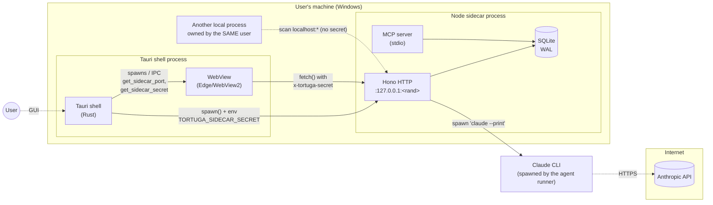

# Tortuga OS — Threat model

> STRIDE analysis of the main components. Living document. The goal is not to
> enumerate everything possible but to identify the real risks that define the
> implemented and pending mitigations.

Model date: **2026-05-09**.

## Components and trust boundaries

### Trust zones

| Zone | Who | Trust |
|---|---|---|
| **Z1 — Tauri shell** | Rust, signed code | High. Generates secrets. |
| **Z2 — WebView** | Bundled JS, embedded browser | Medium. Hosts code that passes through the CSP. |
| **Z3 — Sidecar** | Node, Hono, Drizzle | Medium. Receives HTTP, MCP, writes the DB. |
| **Z4 — Claude CLI** | External process | Medium. Has access to the sidecar `process.env` (inherited). |
| **Z5 — Another process owned by the same user** | Any local malware with your UID | NOT trusted. It is exactly the attacker the handshake protects against. |
| **Z6 — Internet (Anthropic)** | HTTPS API | External. Only Claude CLI talks to it. |

The critical trust boundaries are: Z2↔Z3 (CSP + handshake), Z5↔Z3 (handshake), Z3↔Z4 (inherited env, controlled paths).

---

## Component 1 — Tauri shell (Rust)

**Assets**: the handshake nonce, the `127.0.0.1:port` binding, the `app_data_dir` path, the sidecar process handles.

| STRIDE | Threat | Mitigation |
|---|---|---|
| **S** | Another local app impersonates the shell to the sidecar. | The sidecar only knows the secret THIS shell passed via env vars. Another process can't read the child's env. |
| **T** | Tampering of the shell binary after installation. | Out of scope today (apply code signing + Tauri updater Ed25519 — debt 3.20). |
| **R** | Repudiation of shell actions. | Tauri logging via `tauri-plugin-log` — local log. No external audit for now. |
| **I** | Secret leak to stdout/log. | The shell explicitly does NOT log the value (`log::info!("... secret generated")` only). The secret is cleared from state on `kill_sidecar`. |
| **D** | A shell crash kills the sidecar; the app stops working. | Accepted (single instance). Can be restarted manually. |
| **E** | Privilege escalation from Rust to the OS. | Minimal Tauri capabilities (`core:default` + `core:window` + `log`). No `shell:execute` or `fs:write-all` declared. |

**Pending**:
- Code signing of the binary in the build (future release).
- Verify `sidecar.cjs` before spawning it (signature or hash). Today the installer's bundle is trusted.

---

## Component 2 — WebView (React + Vite)

**Assets**: the secret received via `get_sidecar_secret`, the TanStack queries to the API.

| STRIDE | Threat | Mitigation |
|---|---|---|
| **S** | An external page loaded in the WebView steals the secret. | CSP `frame-ancestors 'none'`, limited `connect-src`, `script-src 'self'`. No loaded external URLs. |
| **T** | XSS via task description modifies the DOM. | `renderMarkdown` applies `escapeHtml` before rendering; `dangerouslySetInnerHTML` only receives safe HTML. |
| **R** | n/a | Client; audit in the sidecar. |
| **I** | Secret exposed via `window.__TAURI_INTERNALS__` to injected scripts. | No external scripts (CSP). The secret is cached in a closed-over variable (not global), but an attacker with XSS would read everything indirectly — the primary mitigation is preventing XSS. |
| **D** | DoS via a giant payload (100 MB description). | Content limits in HTTP (`MAX_BODY_BYTES`); on the client, prior Zod validation (once added). |
| **E** | Access from JS to the filesystem or shell. | Tauri capabilities don't expose FS. Only `core:*` and `log:default`. |

**Pending**:
- Migrate `dangerouslySetInnerHTML` to `react-markdown` with `rehype-sanitize` to stop relying on a custom sanitizer (medium debt).
- CSP `script-src` currently includes `http://localhost:5173` for Vite HMR — only active in dev, ignored in prod via the `tauri://` URL. Acceptable.

---

## Component 3 — Sidecar (Hono + Node)

**Assets**: the SQLite (the whole company's operation), the handshake secret, the Claude CLI spawn handle.

| STRIDE | Threat | Mitigation |
|---|---|---|
| **S** | Another local process makes requests to `/api/*` impersonating the shell. | `x-tortuga-secret` header required. No secret → 401. Constant-time comparison. |
| **T** | SQL injection via endpoints. | 100% queries via Drizzle ORM (typed). Literal SQL migrations take no input. |
| **T** | Path traversal via agentsDir or future endpoints. | `safeResolveUnder` enforces a prefix check. |
| **T** | Tampering of `auto_mode` by a local process. | Behind the handshake; a process without the secret can't touch it. |
| **R** | No persistent audit log of HTTP operations. | `kanbanMovements` records moves; `agentRuns` records executions. For generic CRUD (clients, tasks) there's no audit log — accepted in this phase, an `audit_log` table could be added. |
| **I** | Logger leaks the secret. | `redact` covers `x-tortuga-secret`, auth, password, taxId, etc. Defense in depth. |
| **I** | DB on disk unencrypted. | Accepted: the DB is in `%APPDATA%/Tortuga-OS` which is under the user's ACL. At-rest encryption is evaluated for F5 (sqlcipher). |
| **D** | Giant body saturates memory. | `MAX_BODY_BYTES = 1 MiB`, `content-length` check before parsing JSON. |
| **D** | MCP tool runs for hours. | `withTimeout(30 s)` per tool; output limited to 1 MiB. |
| **D** | Agent run never finishes (Claude CLI hangs). | Accepted: the user can `cancelAgentRun`; the runner `kill()`s the child. A hard per-run timeout can be added in an iteration. |
| **E** | Privilege escalation via Claude CLI running FS tools. | Claude CLI runs with `cwd = repoPath` and the sidecar env; the tools Claude uses are defined in its own config. Out of scope for the sidecar. Document that Claude CLI should run with its own sandbox. |

**Pending**:
- Generic audit log for CRUD (medium debt).
- DB encryption-at-rest (medium debt).
- Hard per-agent-run timeout (low debt).

---

## Component 4 — MCP server (stdio)

**Assets**: the stdio handle, the same SQLite tables as the HTTP server.

| STRIDE | Threat | Mitigation |
|---|---|---|
| **S** | Any MCP client that invokes the server (the user's Claude Code or Claude Desktop). | The stdio server responds to whoever spawns it — there's no authentication because stdio implies the parent controls it. Accepted: if malware is spawning MCP servers, the attacker is already on the machine with the user's permissions. |
| **T** | Malformed tool args. | `inputSchema.parse(args)` with strict Zod. |
| **R** | No audit log of invoked tools. | The HTTP sidecar logs `agentRuns` but standalone MCP tools don't — minimal logging via `[mcp]` to stderr. Acceptable for now. |
| **I** | Tool output includes sensitive data (emails, taxIds). | The DTOs expose them explicitly — that's a feature, not a bug. The mitigation is controlling who runs the MCP server (the user themselves). |
| **D** | A tool runs forever. | `withTimeout` applied in `mcp/server.ts`. |
| **D** | Giant output saturates the MCP client. | `MAX_OUTPUT_BYTES = 1 MiB` with a clear error to the client. |
| **E** | The MCP process writes the DB in an unauthorized way. | Same tables as HTTP — accessed via use-cases that validate business rules (legal transitions, soft-delete checks). |

---

## Component 5 — Local DB (SQLite)

**Assets**: all operational entities (clients, projects, tasks, agent_runs, milestones).

| STRIDE | Threat | Mitigation |
|---|---|---|
| **S** | Another local process reads/writes `tortuga.db` directly. | Partially accepted: any process owned by the user can open the DB with `better-sqlite3`. The real defense is the filesystem ACL (`%APPDATA%`). For apps touching real finances: encrypt with sqlcipher (future). |
| **T** | Direct manipulation of the `.db` file. | The sidecar validates foreign keys (`PRAGMA foreign_keys = ON`). This catches macro inconsistencies but provides no cryptographic integrity. |
| **R** | Unaudited manual modifications. | `kanbanMovements` records card moves; `agentRuns` records runs. Basic CRUD has no audit log. |
| **I** | A leaked DB backup. | Accepted: the DB is the company's data; its confidentiality depends on the user. Offer an encrypted export in F5. |
| **D** | Corrupt DB from a mid-write crash. | WAL + `synchronous = NORMAL` recovers after a crash. Manual backups recommended. |
| **E** | n/a | The DB is a file, not a process. |

---

## Summary of mitigations by threat

| Threat | Primary mitigation |
|---|---|
| HTTP client spoofing | 122-bit handshake nonce, constant-time compare |
| SQL injection | Typed Drizzle ORM |
| XSS in the WebView | Strict CSP + escapeHtml in markdown |
| Path traversal | `safeResolveUnder` |
| Secret leak | Pino redact + Rust no-log |
| DoS giant body | `MAX_BODY_BYTES` |
| DoS eternal MCP tool | `withTimeout` + `MAX_OUTPUT_BYTES` |
| Tauri privilege escalation | Minimal capabilities |
| Process spoofing at spawn | env-var passing of the secret (not in CLI args or on disk) |

## Accepted residual risks

1. **Local malware with the user's permissions** that could inject itself into the sidecar process. Out of scope for the app — defense at the OS level.
2. **DB at-rest unencrypted**. Accepted for F0-F3; revisit in F5.
3. **No universal CRUD audit log**. Accepted for F0-F3.
4. **Claude CLI run by the agent runner inherits the env**. We assume `claude` is not hostile; if Anthropic ships a malicious binary that's an upstream problem.
5. **Cargo.lock not committed**. Allows drift of Rust deps between machines. Prioritized debt (audit 3.13).

## Next review

Before the first signed release.
